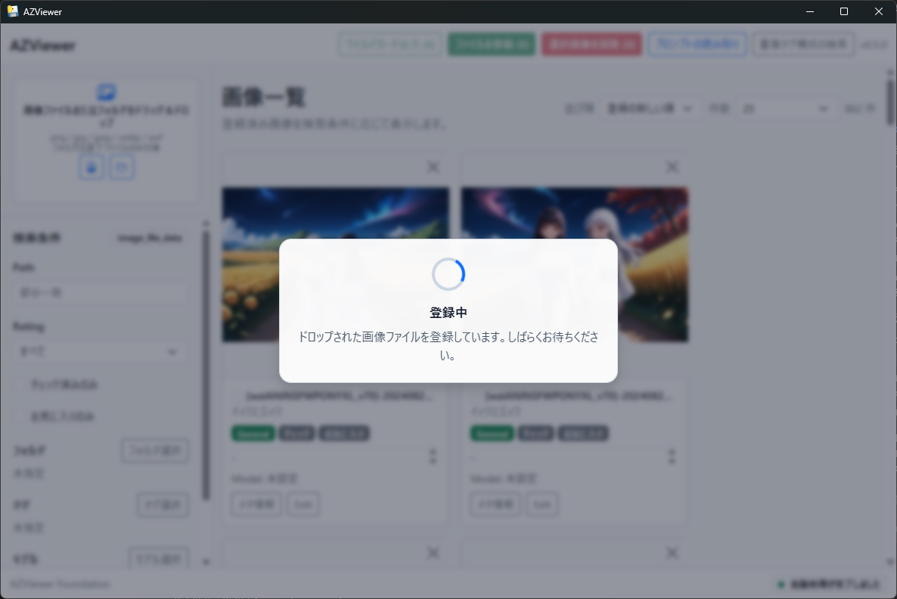
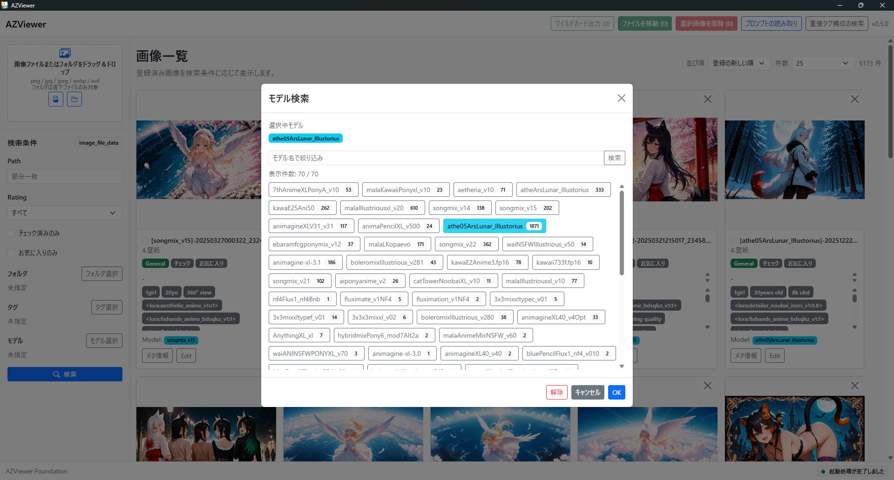
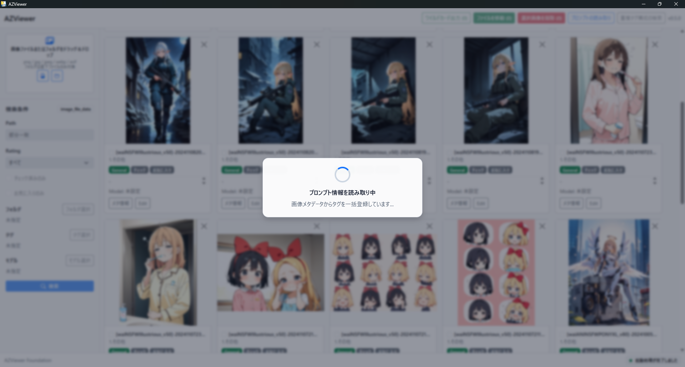

# AZViewer

AZViewer は、ローカル画像を登録・閲覧・検索・整理するための Windows 向けデスクトップアプリです。

Stable Diffusion WebUI で生成した画像のメタ情報、Positive prompt 由来タグ、caption ファイル由来タグ、生成元モデルを扱いやすくすることを主な目的にしています。画像をタイル表示しながらタグやモデルで絞り込み、必要に応じて Stable Diffusion WebUI 用のワイルドカード `.txt` や、LoRA 作成向けの caption `.txt` を出力できます。


## ダウンロード

最新版は GitHub Releases から取得できます。

- リリースページ: https://github.com/Sunao-Yoshii/AZViewer/releases/latest
- Windows 版: `AZViewer-windows-portable.zip`
- 対応 OS: Windows 11 64bit
- 現在のアプリ表示バージョン: `1.5.0`

`AZViewer-windows-portable.zip` を展開し、`AZViewer.exe` を実行してください。Python 実行環境は同梱されているため、利用する PC に Python を別途インストールする必要はありません。

### 実行環境の要件

AZViewer は Windows 11 の最新パッチ適用済み環境での動作を前提にしています。

- OS: Windows 11 64bit
- .NET Framework: 4.8.1 以上
- WebView2 Runtime: Evergreen Runtime
- Python: インストール不要。CPython 3.12 由来の実行環境をアプリに同梱しています。
- Visual C++ Runtime: インストール不要。必要な `VCRUNTIME140.dll`、`VCRUNTIME140_1.dll`、`ucrtbase.dll` はアプリに同梱しています。

Windows 11 には通常 WebView2 Runtime が含まれますが、企業管理端末、オフライン環境、Windows コンポーネントの破損などで削除または無効化されている場合は、Microsoft Edge WebView2 Runtime の修復または再インストールが必要です。

### 展開と起動時の注意

- 既存の `AZViewer` フォルダへ上書き展開せず、古いフォルダを削除してから新しい ZIP を展開してください。`AZViewer.exe` と `_internal` のバージョンが混在すると起動に失敗することがあります。
- `C:\Program Files` などの管理者権限が必要な場所ではなく、ユーザーが書き込めるフォルダへ展開してください。AZViewer は起動場所配下の `data` フォルダにデータベースとサムネイルキャッシュを作成します。
- セキュリティソフトや Microsoft Defender により `_internal` 配下の DLL が隔離された場合、起動に失敗することがあります。隔離履歴を確認し、ZIP を再展開してください。
- ダブルクリック起動で何も表示されず終了する場合は、`%LOCALAPPDATA%\AZViewer\logs\azviewer.log` を確認してください。`%LOCALAPPDATA%` に書き込めない環境では、展開先の `logs\azviewer.log`、カレントディレクトリの `logs\azviewer.log`、一時フォルダの `AZViewer\logs\azviewer.log` の順に出力先を切り替えます。
- ログ出力先を明示したい場合は、環境変数 `AZVIEWER_LOG_DIR` にログフォルダのパスを設定してください。

## 主な機能

- ローカル画像の登録、タイル表示、詳細ビューア表示
- ファイル選択、フォルダ選択、ドラッグ&ドロップによる画像登録
- `png`, `jpg`, `jpeg`, `webp`, `avif` 形式への対応
- レーティング、チェック状態、お気に入り、コメント、タグ、生成元モデルの編集
- タグ検索、タグ部分一致検索、フォルダ検索、モデル検索、重複タグ構成検索
- 表示中画像の一括選択と選択解除
- 選択画像のレーティング、チェック状態、お気に入りの一括編集
- Stable Diffusion WebUI の Positive prompt からのタグ一括読み取り
- 画像と同名の caption `.txt` からのタグ読み込み
- 選択画像へのタグ一括追加
- 選択画像タグの Stable Diffusion WebUI ワイルドカード `.txt` 出力
- 選択画像タグの caption `.txt` 出力
- 画像ファイルのリネーム
- 選択画像のファイル移動
- 選択画像の OS ごみ箱への移動
- 選択画像の AZViewer 管理対象からの除外
- 画像の保存場所をエクスプローラで開く
- タグ、モデルのマスタメンテナンス
- 画像メタ情報の表示、コピー、タグ入力への流用


## 基本的な使い方

### 1. 画像を登録する

左側の登録エリアから画像ファイルまたはフォルダを選択します。画像やフォルダをアプリ画面へドラッグ&ドロップして登録することもできます。

フォルダ登録では、対象フォルダ直下の対応画像ファイルを登録します。登録済み画像はタイル形式で一覧表示されます。



### 2. 画像を探す

検索フォームから、パス、レーティング、チェック状態、お気に入り、タグ、タグ部分一致、フォルダ、生成元モデルで絞り込めます。

タグ検索は最大 3 件まで指定でき、複数指定時は AND 条件で検索します。タグ部分一致では、入力した文字列を含むタグが付いた画像を検索できます。タグ検索とタグ部分一致を同時に指定した場合は、両方を満たす画像を検索します。

フォルダ検索とモデル検索は、候補一覧から 1 件を選ぶ完全一致検索です。同じタグ構成を持つ画像を探す重複タグ構成検索も利用できます。



### 3. 画像情報を編集する

各画像タイルから、レーティング、チェック状態、お気に入り、コメント、タグ、生成元モデルを編集できます。

タグは ASCII カンマ `,` 区切りで複数入力できます。1 タグあたりの最大長は 512 文字です。全角カンマ `，` や読点 `、` は区切り文字として扱いません。

Stable Diffusion WebUI のプロンプトからタグを作る場合は、メタ情報表示から必要な範囲を選択し、タグ入力欄へ流用できます。

### 4. 詳細ビューアで画像を確認する

タイルの画像を開くと、詳細ビューアで元画像を確認できます。

- 通常表示では、縦長画像も横長画像も画面内に収まるように表示します。
- 実寸表示では、画像本来のサイズで表示し、必要に応じてスクロールできます。
- `ArrowLeft` / `ArrowRight` で現在ページ内の前後画像へ移動できます。
- `Escape` で閉じます。
- `Delete` で表示中画像を OS ごみ箱へ移動します。
- サイドバーから、エクスプローラで開く、属性編集、リネーム、ごみ箱へ移動を実行できます。

詳細ビューア自体は API を直接呼ばず、操作イベントを親画面へ通知します。実際のファイル操作や DB 更新はアプリ側の処理に委譲されます。

### 5. タグを一括で読み取る・追加する

ヘッダーの「タグ操作」から、タグ関連の一括処理を実行できます。

- プロンプトの読み取り: タグ未登録の画像を対象に、Stable Diffusion WebUI の Positive prompt を画像メタ情報から読み取り、タグとして登録します。
- キャプションタグ読み込み: 選択画像と同じフォルダにある同名 `.txt` を caption ファイルとして読み取り、既存タグへ追加登録します。
- 一括タグ追加: 選択画像すべてに、入力したタグをまとめて追加します。
- 重複タグ構成の検索: 同じタグ構成を持つ画像を検索します。

プロンプトの読み取りでは、既にタグが登録されている画像は対象外です。生成元モデルが未設定の画像については、メタ情報からモデル名を読み取れる場合にモデル情報も登録します。

caption タグ読み込みと一括タグ追加では、既存タグは削除されず、読み込んだタグまたは入力したタグが追加されます。重複するタグは二重登録されません。



> **注意**
> メタデータから Stable Diffusion WebUI のプロンプト情報も読み取りたい場合は、必ず先に「プロンプトの読み取り」を実行してください。
>
> 「キャプションタグ読み込み」を先に実行すると、対象画像にタグが追加されます。その後は「プロンプトの読み取り」の対象外となるため、メタデータ由来のタグ情報を一括読み取りできなくなります。

### 6. 画像を整理する

画像一覧で複数画像を選択すると、一括操作を実行できます。

- 表示中をすべて選択: 現在ページに表示されている画像をまとめて選択します。表示中の画像がすべて選択済みの場合は、表示中の選択を解除します。
- 選択画像を一括編集: 選択画像のレーティング、チェック状態、お気に入りをまとめて更新します。変更する項目だけを選択できるため、指定していない項目は上書きされません。
- アウトプット > ワイルドカード出力: 選択画像のタグを `1画像 = 1行` の `.txt` として保存、または既存ファイルへ追記します。
- アウトプット > タグ出力: 選択画像のタグを、各画像と同じフォルダに同名の caption `.txt` として出力します。既存 `.txt` がある場合は上書きされます。
- ファイル操作 > ファイルを移動: 選択画像の実ファイルを指定フォルダへ移動し、AZViewer 上のパス情報も更新します。
- ファイル操作 > ごみ箱へ移動: 選択画像の実ファイルを OS ごみ箱へ移動し、移動に成功した画像を AZViewer の管理対象から除外します。
- ファイル操作 > 選択画像を管理対象から除外: 実画像ファイルには触れず、AZViewer 上の登録情報、タグ関連情報、モデル関連情報、サムネイルキャッシュを削除します。

表示中画像の一括選択は、現在のページに表示されている画像だけを対象にします。検索条件に一致する全件や、別ページの画像は対象外です。

### 7. タグとモデルをメンテナンスする

ヘッダーの「マスタメンテナンス」から、タグメンテナンスまたはモデルメンテナンスを開けます。

- タグメンテナンス: タグの検索、削除、別タグ名への置き換え、未使用タグの一括削除ができます。
- モデルメンテナンス: モデル名の検索、削除、別モデル名への置き換え、未使用モデルの一括削除ができます。

一覧には使用件数が表示されます。使用中のタグやモデルを削除する場合は、紐づいている画像からそのタグやモデルの関連付けが外れます。置き換え先が既存のタグ名やモデル名と同じ場合は、既存マスタへ統合されます。

## データ保存について

AZViewer はローカルの SQLite データベースで登録情報を管理します。標準では、起動した場所の `data/az_data.sqlite3` に保存されます。サムネイルキャッシュも `data` 配下に作成されます。

登録される主な情報は、画像ファイルのパス、レーティング、チェック状態、お気に入り、コメント、タグ、生成元モデルです。元画像そのものをアプリ内にコピーするのではなく、ローカルファイルの場所を参照して管理します。

起動時には、登録済みパスの実ファイルが存在するかを確認し、存在しないファイルの登録情報とサムネイルキャッシュを整理します。

## ファイル操作の考え方

AZViewer は、実画像ファイルの即時完全削除 API を持ちません。画像を整理する操作は次の 2 種類です。

- 管理対象から除外: 実画像ファイルは残し、AZViewer の登録情報だけを削除します。
- ごみ箱へ移動: `send2trash` を使って実画像ファイルを OS ごみ箱へ移動し、成功した画像を AZViewer の管理対象から除外します。

ごみ箱へ移動した画像は OS 側のごみ箱から復元できる場合がありますが、環境や保存場所によっては復元できないことがあります。重要な画像を扱う場合は事前にバックアップを取ってください。

## 注意事項

- ファイル移動、ごみ箱移動、リネームは実ファイル操作と DB 更新を組み合わせて処理します。実行前に対象画像を確認してください。
- 「管理対象から除外」は実画像ファイルを削除しません。画像ファイルを AZViewer から外したいだけの場合に使用してください。
- 「ごみ箱へ移動」は実画像ファイルを OS ごみ箱へ移動します。成功した画像は AZViewer の管理対象からも除外されます。
- 画像ファイルのリネームでは、空文字、パス区切り文字、Windows 禁止文字、拡張子変更、既存ファイル上書きを拒否します。
- タグメンテナンスやモデルメンテナンスで使用中のタグ・モデルを削除すると、対象画像からそのタグ・モデルの関連付けが外れます。
- 画像メタ情報はファイル形式や生成環境によって異なります。すべての画像でプロンプトやモデル名を取得できるとは限りません。
- caption ファイル読み込みは、選択画像と同じフォルダにある同名 `.txt` を読み込み、既存タグへ追加します。caption ファイルが存在しない画像や、空の caption ファイルはスキップされます。
- 一括タグ追加は、選択画像すべてに同じタグを追加します。意図しないタグを大量に付与しないよう、実行前に選択対象を確認してください。
- ワイルドカード出力は、AZViewer に登録済みのタグを元に生成します。保存前にプレビューを確認してください。
- タグ出力は、画像と同名の `.txt` を上書き作成します。既存の caption ファイルを手作業で編集している場合は注意してください。
- 既存 DB を使い回す場合、DB の `tag` テーブル制約が現在のタグ最大長 512 文字に合っていない可能性があります。必要に応じて `data` 配下をバックアップしたうえで再作成してください。

## 開発者向け

このアプリは Python + pywebview + Vue + Bootstrap で構成されています。

### ローカル実行

```powershell
python -m venv .venv
.\.venv\Scripts\Activate.ps1
pip install -r backend\requirements.txt

cd frontend
npm install
npm run build
cd ..

python backend\main.py
```

### フロントエンド開発サーバー

```powershell
cd frontend
npm install
npm run dev
```

別の PowerShell で pywebview を起動します。

```powershell
$env:AZVIEWER_FRONTEND_URL = "http://127.0.0.1:5173"
python backend\main.py
```

### Windows リリースビルド

リリースビルドは `C:\Python312\python.exe` にインストールした 64bit CPython 3.12 を使用します。PATH に Python を追加する必要はありません。

```powershell
.\build_windows.ps1
```

ビルドが成功すると、以下が生成されます。

- `dist\AZViewer\AZViewer.exe`
- `dist\AZViewer-windows-portable.zip`

ビルド時には、配布物に Python runtime、pythonnet、clr-loader、WebView2 の .NET interop DLL、Visual C++ runtime が同梱されていることを検証します。`send2trash` も PyInstaller / spec の両方で明示収集しています。

### 主なライブラリ

- pywebview 6.2.1
- pythonnet 3.0.5
- clr-loader 0.2.10
- Pillow 11 系
- send2trash
- SQLAlchemy 2
- PyInstaller 6.20.0
- Vue 3.5
- Vite 6
- Bootstrap 5.3
- Bootstrap Icons 1.11
