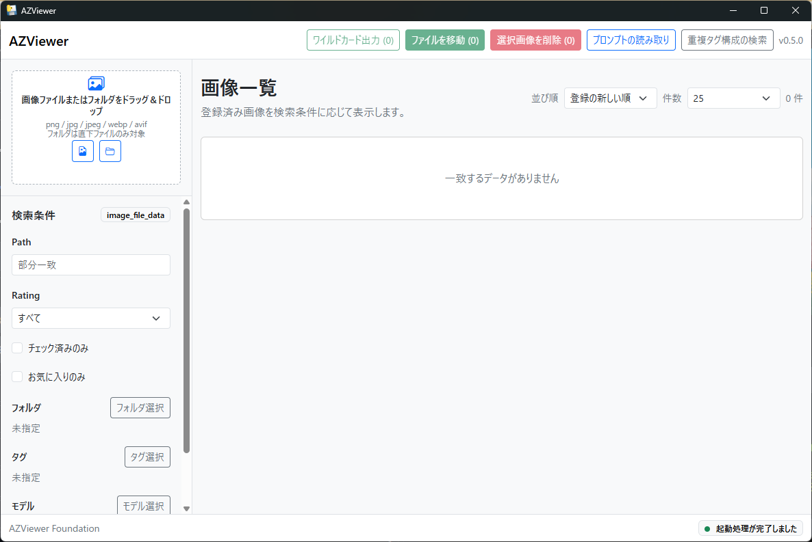
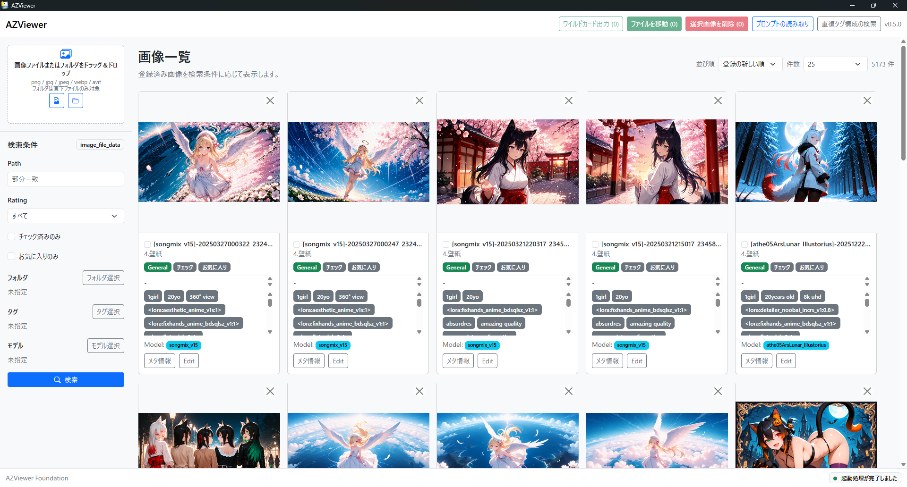

# AZViewer

AZViewer は、ローカル画像を登録・閲覧・検索・整理するための Windows 向けデスクトップアプリです。

Stable Diffusion WebUI で生成した画像のメタ情報、プロンプト由来タグ、生成元モデルを扱いやすくすることを主な目的にしています。画像をタイル表示しながら、タグやモデルで絞り込み、必要に応じて Stable Diffusion WebUI 用のワイルドカード `.txt` も出力できます。



## ダウンロード

最新版は GitHub Releases から取得できます。

- リリースページ: https://github.com/Sunao-Yoshii/AZViewer/releases/tag/1.1.0
- Windows 版: `AZViewer-windows-portable.zip`

`AZViewer-windows-portable.zip` を展開し、`AZViewer.exe` を実行してください。Python 実行環境は同梱されているため、利用する PC に Python を別途インストールする必要はありません。

## 主な機能

- ローカル画像の登録、閲覧、詳細表示
- ファイル選択、フォルダ選択、ドラッグ&ドロップによる画像登録
- `png`, `jpg`, `jpeg`, `webp`, `avif` 形式への対応
- レーティング、チェック状態、お気に入り、コメントの編集
- 画像ごとのタグ管理
- Stable Diffusion WebUI の Positive prompt を読み取り、タグとして一括登録
- 生成元モデル名の登録、表示、検索
- パス、レーティング、チェック状態、お気に入り、タグ、フォルダ、モデルによる検索
- 同じタグ構成を持つ画像の検索
- 選択画像の一括ファイル移動
- 選択画像の一括物理削除
- 選択画像のタグを Stable Diffusion WebUI ワイルドカード `.txt` として出力
- 画像メタ情報の表示、コピー、タグ入力への流用



## 基本的な使い方

### 1. 画像を登録する

左側の登録エリアから画像ファイルまたはフォルダを選択します。画像やフォルダをアプリ画面へドラッグ&ドロップして登録することもできます。

フォルダ登録では、対象フォルダ直下の対応画像ファイルを登録します。登録済み画像はタイル形式で一覧表示されます。

### 2. 画像を探す

検索フォームから、パス、レーティング、チェック状態、お気に入り、タグ、フォルダ、生成元モデルで絞り込めます。

タグ検索は最大 3 件まで指定でき、複数指定時は AND 条件で検索します。フォルダ検索とモデル検索は、候補一覧から 1 件を選ぶ完全一致検索です。

### 3. 画像情報を編集する

各画像タイルから、レーティング、チェック状態、お気に入り、コメント、タグ、生成元モデルを編集できます。

タグはカンマ区切りで複数入力できます。Stable Diffusion WebUI のプロンプトからタグを作る場合は、メタ情報表示から必要な範囲を選択し、タグ入力欄へ流用できます。

### 4. プロンプトを一括で読み取る

ヘッダーの「プロンプトの読み取り」から、タグ未登録の画像を対象に Stable Diffusion WebUI の Positive prompt を読み取り、タグとして登録できます。

既にタグが登録されている画像は対象外です。生成元モデルが未設定の画像については、メタ情報からモデル名を読み取れる場合にモデル情報も登録します。

### 5. 画像を整理する

画像一覧で複数画像を選択すると、一括操作を実行できます。

- ファイルを移動: 選択画像の実ファイルを指定フォルダへ移動し、AZViewer 上のパス情報も更新します。
- 選択画像を削除: AZViewer 上の登録情報、サムネイルキャッシュ、実際の画像ファイルをまとめて削除します。
- ワイルドカード出力: 選択画像のタグを `1画像 = 1行` の `.txt` として保存、または既存ファイルへ追記します。

## データ保存について

AZViewer はローカルの SQLite データベースで登録情報を管理します。標準では、起動した場所の `data/az_data.sqlite3` に保存されます。サムネイルキャッシュも `data` 配下に作成されます。

登録される主な情報は、画像ファイルのパス、レーティング、チェック状態、お気に入り、コメント、タグ、生成元モデルです。元画像そのものをアプリ内にコピーするのではなく、ローカルファイルの場所を参照して管理します。

## 注意事項

- 一括物理削除は、AZViewer 上の登録情報だけでなく実際の画像ファイルも削除します。実行前に対象画像を確認してください。
- 一括移動や一括削除では、ファイル操作と DB 更新を組み合わせて処理します。重要な画像を扱う場合は事前にバックアップを取ってください。
- 画像メタ情報はファイル形式や生成環境によって異なります。すべての画像でプロンプトやモデル名を取得できるとは限りません。
- ワイルドカード出力は、AZViewer に登録済みのタグを元に生成します。保存前にプレビューを確認してください。
- 開発版で作成した古い DB を使い回す場合、正式版の DB 構造と合わない可能性があります。必要に応じて `data` 配下をバックアップしてください。

## 開発者向け

このアプリは pywebview + Vue + Bootstrap で構成されています。

### ローカル実行

```powershell
python -m venv .venv
.\.venv\Scripts\Activate.ps1
pip install -r backend\requirements.txt

cd frontend
npm install
npm run build
cd ..

python backend\main.py
```

### フロントエンド開発サーバー

```powershell
cd frontend
npm run dev
```

別の PowerShell で pywebview を起動します。

```powershell
$env:AZVIEWER_FRONTEND_URL = "http://127.0.0.1:5173"
python backend\main.py
```

### Windows リリースビルド

```powershell
.\build_windows.ps1
```

ビルドが成功すると、以下が生成されます。

- `dist\AZViewer\AZViewer.exe`
- `dist\AZViewer-windows-portable.zip`
